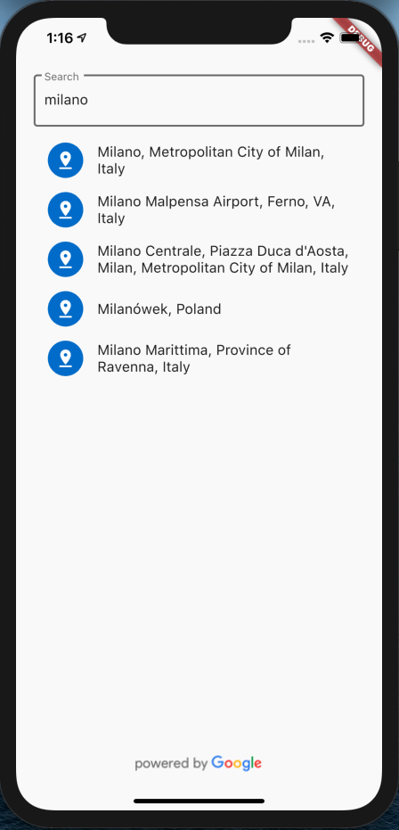
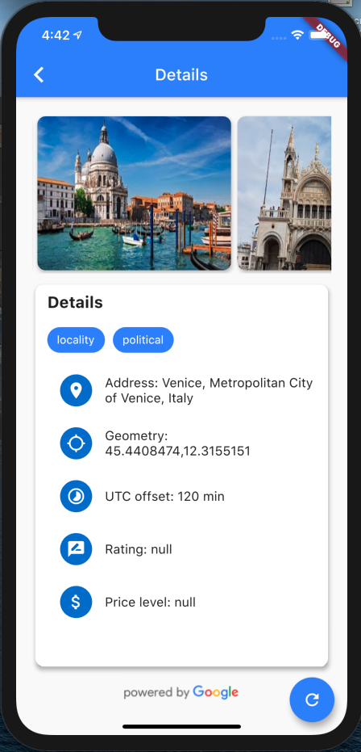

# google_places_location


A Flutter plugin for iOS and Android and Web that provides a [Google Place API](https://developers.google.com/places/web-service/intro).

## Preview

The Places API is a service that returns information about places using HTTP requests. Places are defined within this API as establishments, geographic locations, or prominent points of interest.

The following place requests are available:

1. [Place Search](https://developers.google.com/places/web-service/search) returns a list of places based on a user's location or search string.
2. [Place Details](https://developers.google.com/places/web-service/details) returns more detailed information about a specific place, including user reviews.
3. [Place Photos](https://developers.google.com/places/web-service/photos) provides access to the millions of place-related photos stored in Google's Place database.
4. [Place Autocomplete](https://developers.google.com/places/web-service/autocomplete) automatically fills in the name and/or address of a place as users type.
5. [Query Autocomplete](https://developers.google.com/places/web-service/query) provides a query prediction service for text-based geographic searches, returning suggested queries as users type.

## Usage

To use this plugin, add **_google_place_** as a [dependency in your pubspec.yaml file](https://flutter.dev/docs/development/packages-and-plugins/using-packages).

## Getting Started

- Get an API key at [https://cloud.google.com/maps-platform/](https://cloud.google.com/maps-platform/).
  - Go to Google Developers Console.
  - Choose the project that you want to enable Google Place on.

## Example

- [Example](https://github.com/bazrafkan/google_place/blob/master/example)

  
  

## Sample Usage

- Place Autocomplete

```dart
var googlePlace = GooglePlace("Your-Key");
var result = await googlePlace.autocomplete.get("1600 Amphitheatre");
```

- Place Query Autocomplete

```dart
var googlePlace = GooglePlace("Your-Key");
var result = await googlePlace.queryAutocomplete.get("pizza near sydne");
```

- Place Photos

```dart
var googlePlace = GooglePlace("Your-Key");
Uint8List result = await googlePlace.photos.get(
 "CnRtAAAATLZNl354RwP_9UKbQ_5Psy40texXePv4oAlgP4qNEkdIrkyse7rPXYGd9D_Uj1rVsQdWT4oRz4QrYAJNpFX7rzqqMlZw2h2E2y5IKMUZ7ouD_SlcHxYq1yL4KbKUv3qtWgTK0A6QbGh87GB3sscrHRIQiG2RrmU_jF4tENr9wGS_YxoUSSDrYjWmrNfeEHSGSc3FyhNLlBU", null, 400);
```

- Place Details

```dart
var googlePlace = GooglePlace("Your-Key");
Uint8List result = await googlePlace.details.get("ChIJN1t_tDeuEmsRUsoyG83frY4",
        fields: "name,rating,formatted_phone_number")
```

- Place Search

  - Find Place

    ```dart
    var googlePlace = GooglePlace("Your-Key");
    var result = await googlePlace.search.getFindPlace(
        "Museum of Contemporary Art Australia", InputType.TextQuery);
    ```

  - Nearby Search

    ```dart
    var googlePlace = GooglePlace("Your-Key");
    var result = await googlePlace.search.getNearBySearch(
        Location(lat: -33.8670522, lng: 151.1957362), 1500,
        type: "restaurant", keyword: "cruise");
    ```

  - Text Search

    ```dart
    var googlePlace = GooglePlace("Your-Key");
    var result = await googlePlace.search.getTextSearch("restaurants in Sydney");
    ```

## Custom Headers

Now is possible to set custom header to use platform-specific API keys where you must provide the following headers.

```dart
final headers = <String, String>{
      if (defaultTargetPlatform == TargetPlatform.iOS)
        'x-ios-bundle-identifier': Env().bundleIdentifier, // com.my.app
      if (defaultTargetPlatform == TargetPlatform.android) ...{
        'x-android-package': Env().bundleIdentifier, // com.my.app
        'x-android-cert': Env().ANDROID_SIGNING_KEY_SHA1, // signing key used to build/publish the app
      }
    };
var googlePlace = GooglePlace("Your-Key", headers: headers);
```

## Proxy URL for Web

Now is possible to set proxy url for web. **proxyUrl** can be formatted as [https:// || http://]host[:<port>][/<path>][?<url-param-name>=]

```dart
var googlePlace = GooglePlace("Your-Key", proxyUrl: 'https://localhost:5000');
```
